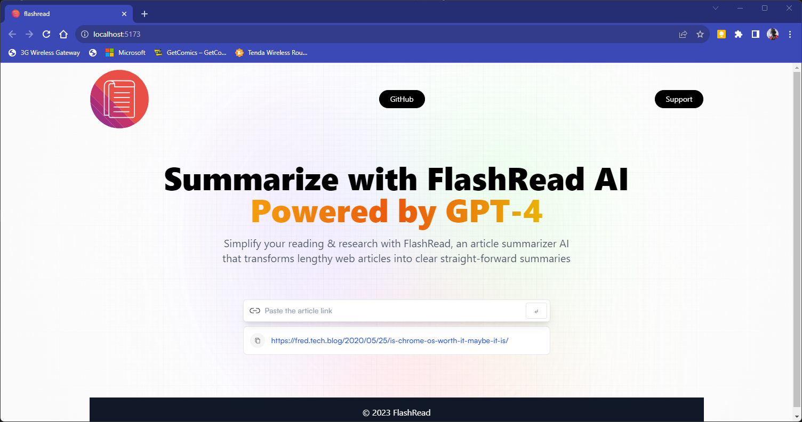
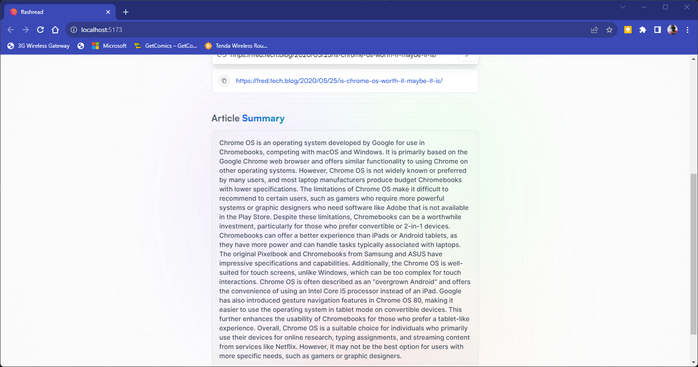

FLASHREAD
=========

FlashRead is a web application that allows users to summarise web articles like news articles and blog posts.
It is built using React, Vite, and Tailwind CSS.

THE INTERFACE ⬇️⬇️⬇️

support the developer by buying me a coffee ☕ at https://www.buymeacoffee.com/fredjuma